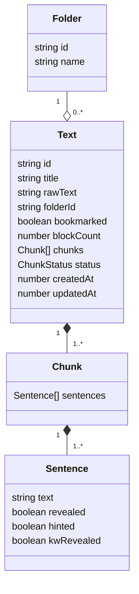
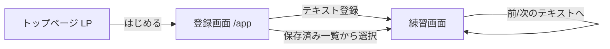
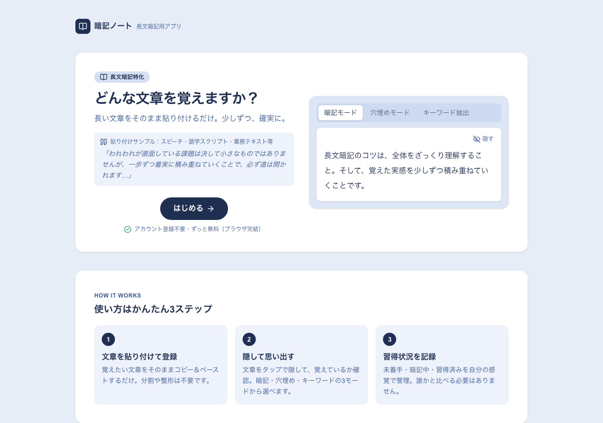
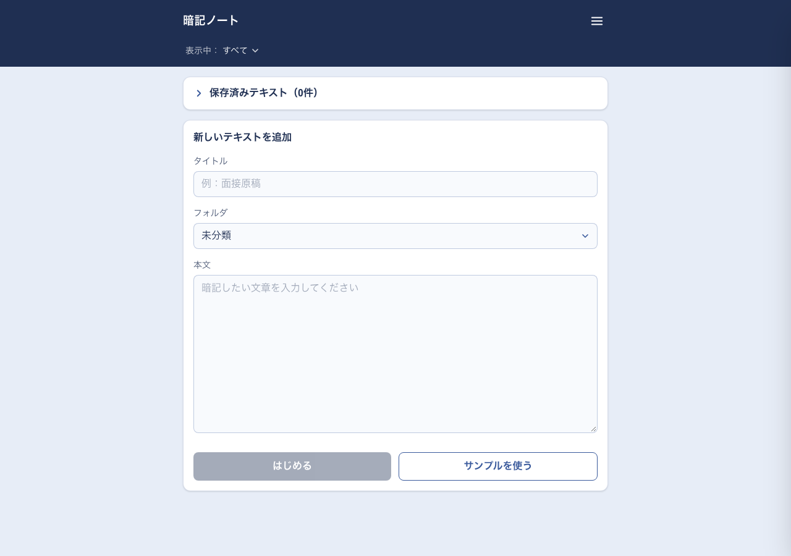
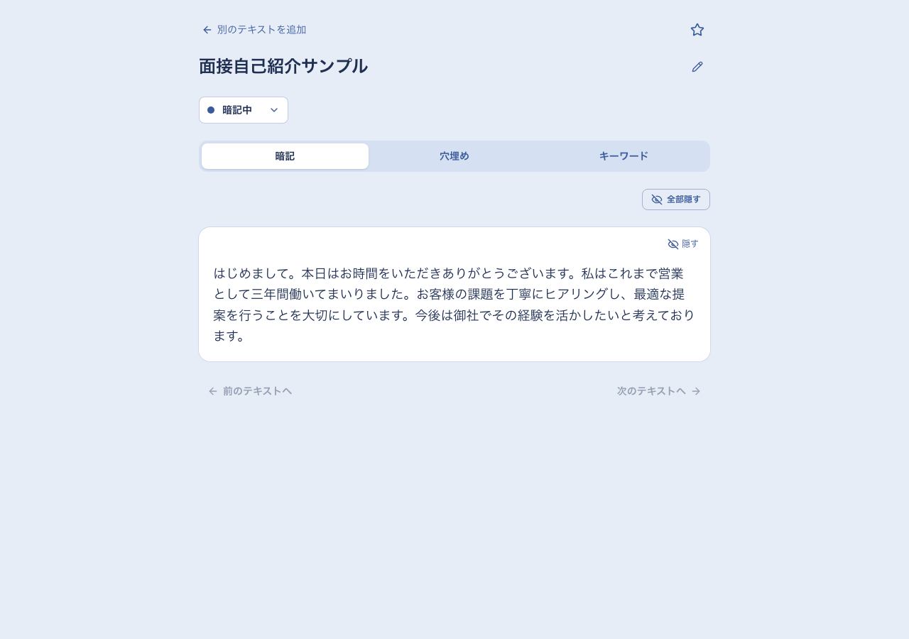
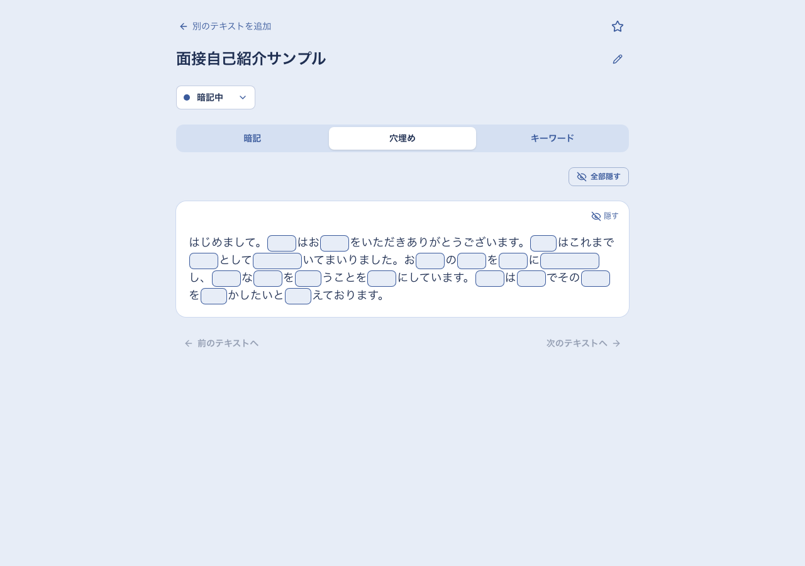
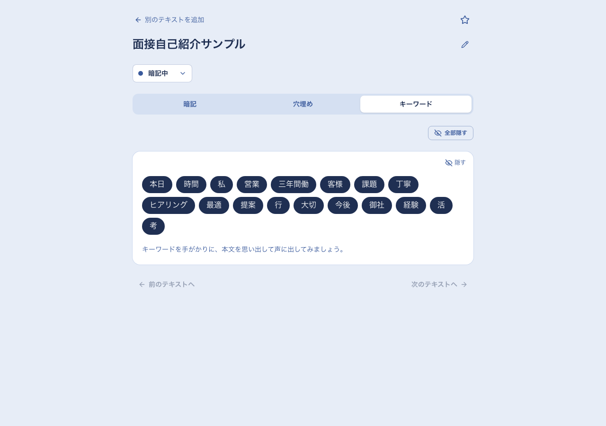
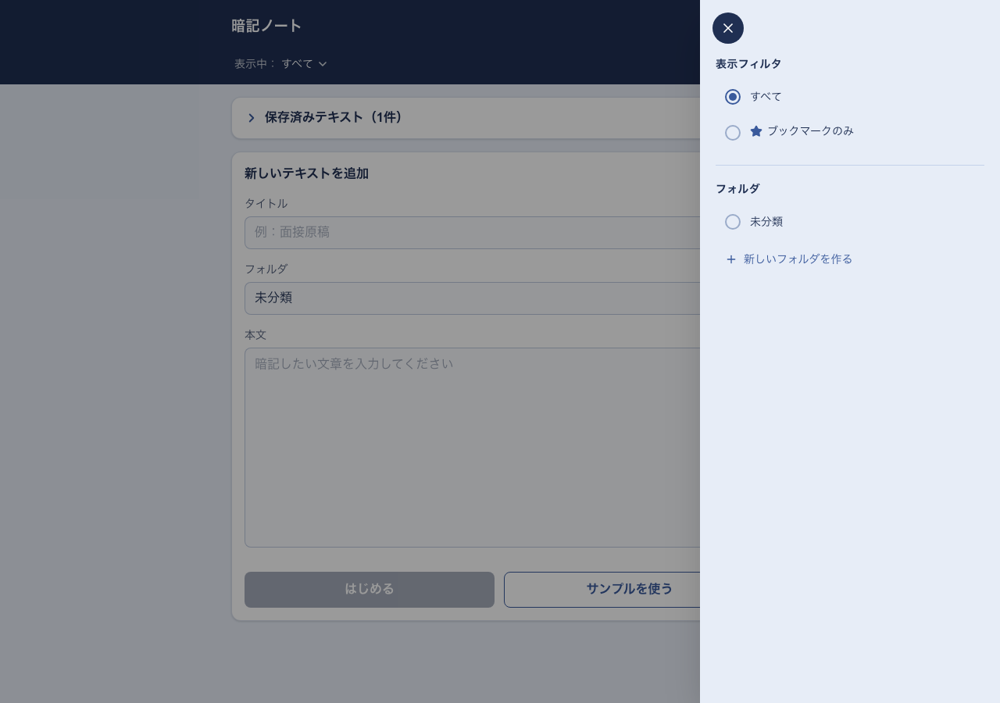

# 暗記ノート
---

### **長い文章を、少しずつ、確実に覚えるためのアプリ**

---


---

- **サービスURL:** https://anki-note.vercel.app/

---

## 🚀 サービス概要（30秒でわかる暗記ノート）
- **解決したい課題:** 面接・スピーチ・発表など、長い文章をまるごと覚えなければならない場面で、一度に暗記しようとして挫折してしまうこと。
- **提供価値:** 貼り付けた文章を「暗記／穴埋め／キーワード」の3つの見せ方で繰り返し練習でき、習得状況を自分の感覚で記録しながら、自分のペースで確実に覚えられる。
- **技術の見どころ:** Next.js（App Router）+ TypeScriptによるフロントエンド完結の設計 / バックエンド・DBを持たずlocalStorageのみでデータを永続化 / トップページのデモに実アプリと同じロジックを再利用したインタラクティブな体験。

---

## 📋 目次
<details>
<summary>クリックで開く</summary>

- [🎯 コンセプト・開発背景](#-コンセプト開発背景)
- [📝 機能一覧](#-機能一覧)
- [✨ こだわり・工夫・苦労した点](#-こだわり工夫苦労した点)
- [🛠 使用技術・選定理由](#-使用技術選定理由)
- [⚙️ セットアップ手順](#️-セットアップ手順)
- [📊 設計資料](#-設計資料)
- [🚀 今後の展望](#-今後の展望)
</details>

---

## 🎯 コンセプト・開発背景
### **「まるごと覚える」をやめて、「少しずつ確実に」を選ぶ**
面接やスピーチ、発表の前には、長い文章をそのまま覚えなければならない場面があります。しかし、一度に全部を暗記しようとすると、覚えた実感が持てないまま不安だけが募り、途中で挫折してしまいがちです。

暗記ノートは、「一度に完璧に覚える」のではなく、暗記・穴埋め・キーワードという異なる負荷の練習方法を行き来しながら、少しずつ確実に文章を自分のものにしていくことを目指したアプリです。

#### **なぜこの設計なのか**
長文暗記の練習方法には、人によって合う・合わないがあります。全文をただ眺めるだけでは物足りない人もいれば、いきなり穴埋めでは挫折してしまう人もいます。暗記ノートでは、同じ文章に対して3つの見せ方（暗記・穴埋め・キーワード）を用意し、その日の自信度に合わせて練習方法を切り替えられるようにしました。

また、「習得状況」は他人と比較するための指標ではなく、あくまで自分の感覚で「未着手／暗記中／習得済み」を申告するだけの、プレッシャーの少ない仕組みにしています。

---

## 📝 機能一覧

### **1. メイン機能（テキスト管理）**
- **長文のそのまま登録**
  文章をコピー＆ペーストするだけで練習を始められます。分割や整形は不要です。
- **フォルダ分類**
  1階層のフォルダで、テキストを目的別（面接用・スピーチ用等）に整理できます。
- **ブックマーク**
  よく練習するテキストに印をつけて、絞り込み表示できます。

### **2. 練習体験**
- **暗記モード**
  文章全体をカードとして表示。タップで隠す/表示を切り替えながら、思い出せるか確認できます。
- **穴埋めモード**
  漢字・カタカナ・数字を自動検出して空欄にし、タップして1つずつ答え合わせできます。
- **キーワードモード**
  自動検出したキーワードだけをチップ表示し、それを手がかりに文章を思い出す練習ができます。
- **習得状況の自己申告**
  未着手／暗記中／習得済みをドロップダウンで記録。誰かと比較する指標ではなく、自分のペースを把握するための仕組みです。

### **3. UX・共通機能**
- **前後のテキストへの移動**
  同じフォルダ内の保存済みテキストを、更新日時順に前後移動できます。
- **アカウント登録不要**
  ブラウザのlocalStorageだけでデータが保存され、サインアップ・ログイン不要ですぐに使えます。
- **トップページのインタラクティブデモ**
  実際のキーワード抽出ロジックを使い、登録前でもアプリの練習体験を試せます。

---

## ✨ こだわり・工夫・苦労した点

### **✨ こだわり：「隠して思い出す」体験をLPだけでも伝える**
トップページに置いた練習デモは、単なる画像やダミーのアニメーションではなく、実際のアプリと同じキーワード抽出ロジックと状態管理を再利用しています。文章で「隠す/表示ができます」と説明するのではなく、実際にタップして体験できるようにすることにこだわりました。

### **💡 工夫：分割機能を「消す」という判断**
当初は長文を複数のブロックに分割して段階的に覚える機能を実装していましたが、手動確認を重ねる中で「句読点や改行の有無によって分割結果が安定しない」「設定次第で意図せず1ブロックになる」といった不具合が繰り返し見つかりました。小手先の修正を重ねるのではなく、思い切って分割機能そのものを廃止し、テキスト全体を1つの練習単位として扱う設計に切り替えることで、根本的にシンプルで壊れにくい仕様にしました。

### **🛠 苦労：Git Flow運用の抜け漏れに気づいて修正**
開発中はfeatureブランチからdevelopへのマージのみを繰り返しており、developからmainへの正式なリリース作業を一度も行っていませんでした。そのため、Vercelとの連携直後の初回デプロイが「Next.jsが検出できない」というエラーで失敗。原因を調査したところ、本番用のmainブランチに一度もアプリのコードが反映されていなかったことが判明しました。release／hotfixブランチを使った正式なリリース手順を整備し直すことで解決しました。

---

## 🛠 使用技術・選定理由

### **1. フロントエンド**
- **Next.js 16（App Router）／ React 19 ／ TypeScript**
  - 選定理由: 学習コストを抑えつつ、モダンなApp Routerの構成を実践したかったため。
- **Tailwind CSS**
  - 選定理由: コンポーネント側でスタイルを完結させ、デザインの調整を素早く行うため。
- **lucide-react**
  - 選定理由: 軽量で一貫したアイコンセットを、必要な分だけ読み込めるため。

### **2. データの永続化**
- **ブラウザのlocalStorageのみ**
  - 選定理由: バックエンド・データベースを持たず、アカウント登録なしで即座に使えるアプリにしたかったため。

### **3. 品質管理**
- **Vitest ／ React Testing Library**
  - 選定理由: Next.jsとの親和性が高く、コンポーネント単位のテストを高速に実行できるため。
- **ESLint**
  - 選定理由: コードスタイルを統一し、レビュー観点のばらつきを減らすため。
- **GitHub Actions**
  - 選定理由: push・PR時にlint・test・buildを自動実行し、`develop`と`main`の両方でデグレを防ぐため。

### **4. インフラ**
- **Vercel（Hobbyプラン）**
  - 選定理由: Next.jsとの親和性が高く、GitHub連携だけで自動デプロイが完結し、無料枠の範囲で運用コストをかけずに公開できるため。

---

## ⚙️ セットアップ手順

```bash
git clone https://github.com/Satou20250828/anki-note.git
cd anki-note
npm install
npm run dev
```

起動後、以下のURLで確認できます。

- トップページ（LP）: http://localhost:3000
- 登録画面: http://localhost:3000/app

### テスト・lint・buildの実行
```bash
npm run test
npm run lint
npm run build
```

---

## 📊 設計資料

### データ構造


### 画面遷移


### 画面一覧
各画面のプレビューです。

| | |
|:---|:---|
| **トップページ（LP）** | **登録画面** |
|  |  |
| **練習画面：暗記モード** | **練習画面：穴埋めモード** |
|  |  |
| **練習画面：キーワードモード** | **メニュー（フォルダ・表示フィルタ）** |
|  |  |

---

## 🚀 今後の展望

### 1. 練習体験の拡充
音声読み上げとの組み合わせなど練習モードの選択肢を増やし、苦手な箇所だけを繰り返し出題する復習機能を検討しています。

### 2. 整理・管理機能の強化
フォルダの並び替えや複数階層への対応、テキストの検索機能を追加していく予定です。

### 3. 技術的な挑戦
PWA化してオフラインでも練習できるようにすることと、Playwrightを使ったE2Eテストの導入を検討しています。
